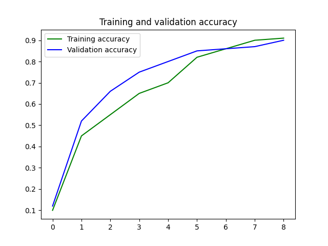
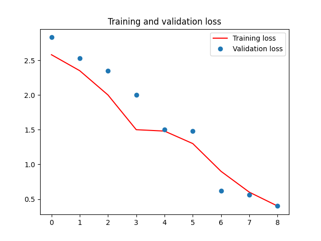

# English-to-Hindi Neural Machine Translation (NMT) using LSTM

This project implements a Neural Machine Translation (NMT) system that translates English sentences into Hindi using an LSTM-based sequence-to-sequence model. The model is trained on paired English-Hindi sentences, and includes functionality for training, inference, and evaluation.

---

## Features

- Preprocessing and tokenization of English and Hindi text.
- Sequence-to-sequence architecture with encoder-decoder LSTM models.
- Training the model and saving trained models for inference.
- Inference models to translate new English sentences to Hindi.

---

## Dataset

The dataset consists of paired English-Hindi sentences. Example input and output:

### Sample English-Hindi Sentence Pair:
- **English:** `new jersey is sometimes quiet during autumn , and it is snowy in april .`
- **Hindi:** `नई जर्सी कभी-कभी शरद ऋतु के दौरान शांत होती है, और यह अप्रैल में बर्फीली होती है।`

### Dataset Files:
- `Data/English.txt`: Contains English sentences.
- `Data/Hindi.txt`: Contains corresponding Hindi sentences.

---

## Getting Started

Follow these steps to set up the project and train the NMT model:

### 1. Clone the Repository

```bash
git clone <repository-url>
cd <repository-folder>
```

### 2. Create a Virtual Environment

We recommend using a Python virtual environment to avoid dependency conflicts.

```bash
# Create a virtual environment
python -m venv tf_env

# Activate the virtual environment
# On Windows:
tf_env\Scripts\activate
# On Mac/Linux:
source tf_env/bin/activate
```

### 3. Install Dependencies

Install all required Python packages from the `requirements.txt` file.

```bash
pip install -r requirements.txt
```

### 4. Directory Structure

Ensure your project directory looks like this:
```
project-folder/
│
├── Data/
│   ├── English.txt          # English sentences
│   ├── Hindi.txt            # Hindi sentences
│   ├── trained_model.keras  # Generated after training
│
├── training.py              # Script for training the model
├── inference.py             # Script for making predictions
├── README.md                # This file
└── requirements.txt         # Python dependencies
```

---

## Training the Model

To train the NMT model, use the `training.py` script. It preprocesses the data, trains the LSTM-based model, and saves the trained weights along with tokenization mappings.

Run the following command:

```bash
python training.py
```

### Outputs of Training
- `trained_model.keras`: The trained model file.
- `encoder_model.keras`: Encoder model for inference.
- `decoder_model.keras`: Decoder model for inference.
- Tokenization-related files:
  - `input_features_dict.npy`
  - `target_features_dict.npy`
  - `reverse_target_features_dict.npy`
  - `max_lengths.npy`

---

## Translating New Sentences

After training the model, you can translate new English sentences into Hindi using the `inference.py` script.

### Steps:
1. Make sure the trained models (`encoder_model.keras` and `decoder_model.keras`) are in the `Data/` directory.
2. Run the `evaluate.py` script:
   ```bash
   python evaluate.py
   ```

# Performance






3. Enter a new English sentence when prompted, and the script will return its Hindi translation.

---

## Virtual Environment Management

### Activating the Virtual Environment
- **Windows**:
  ```bash
  tf_env\Scripts\activate
  ```
- **Mac/Linux**:
  ```bash
  source tf_env/bin/activate
  ```

### Deactivating the Virtual Environment
To deactivate the virtual environment, simply run:
```bash
deactivate
```

---

## requirements.txt

Below is the content of the `requirements.txt` file used for this project:

```text
numpy
tensorflow==2.10.0
keras==2.10.0
```

To install the requirements:
```bash
pip install -r requirements.txt
```

---

## Important Notes

1. Ensure that the dataset files (`English.txt` and `Hindi.txt`) are correctly formatted, with sentences aligned line-by-line.
2. The tokenization process in `training.py` requires proper handling of punctuation in English and Hindi text. Adjustments can be made to improve tokenization if necessary.

---

## Future Improvements

- Use larger datasets for improved translation quality.
- Experiment with pre-trained embeddings like Word2Vec or GloVe for better word representation.
- Implement attention mechanisms for better translation accuracy.

---

## Author

This project was developed to explore sequence-to-sequence models for language translation. Feel free to contribute or open issues for discussions!

---

Happy translating! 😊
